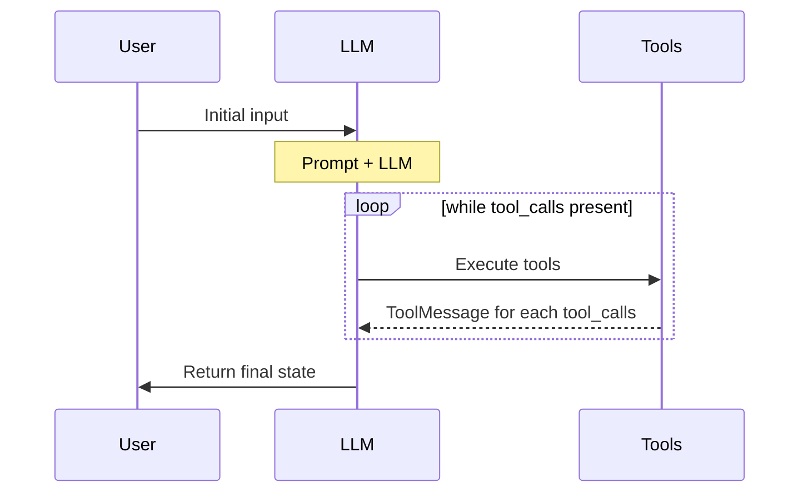

Creates an agent graph that calls tools in a loop until a stopping condition is met.

<Warning>
This function is deprecated in favor of [`create_agent`](https://docs.langchain.com/oss/python/agents/create_agent) from the `langchain` package, which provides an equivalent agent factory with a flexible middleware system. For migration guidance, see [Migrating from LangGraph v0](https://docs.langchain.com/oss/python/migrate/langgraph-v1).
</Warning>

**Defined in:** `langgraph/prebuilt/chat_agent_executor.py:278`

## Function Signature

```python
def create_react_agent(
    model: str
    | LanguageModelLike
    | Callable[[StateSchema, Runtime[ContextT]], BaseChatModel]
    | Callable[[StateSchema, Runtime[ContextT]], Awaitable[BaseChatModel]]
    | Callable[
        [StateSchema, Runtime[ContextT]], Runnable[LanguageModelInput, BaseMessage]
    ]
    | Callable[
        [StateSchema, Runtime[ContextT]],
        Awaitable[Runnable[LanguageModelInput, BaseMessage]],
    ],
    tools: Sequence[BaseTool | Callable | dict[str, Any]] | ToolNode,
    *,
    prompt: Prompt | None = None,
    response_format: StructuredResponseSchema
    | tuple[str, StructuredResponseSchema]
    | None = None,
    pre_model_hook: RunnableLike | None = None,
    post_model_hook: RunnableLike | None = None,
    state_schema: StateSchemaType | None = None,
    context_schema: type[Any] | None = None,
    checkpointer: Checkpointer | None = None,
    store: BaseStore | None = None,
    interrupt_before: list[str] | None = None,
    interrupt_after: list[str] | None = None,
    debug: bool = False,
    version: Literal["v1", "v2"] = "v2",
    name: str | None = None,
) -> CompiledStateGraph
```

## Parameters

<ParamField path="model" type="str | LanguageModelLike | Callable" required>
  The language model for the agent. Supports static and dynamic model selection.

  **Static model**: A chat model instance (e.g., `ChatOpenAI`) or string identifier (e.g., `"openai:gpt-4"`)

  **Dynamic model**: A callable with signature `(state, runtime) -> BaseChatModel` that returns different models based on runtime context. If the model has tools bound via `bind_tools` or other configurations, the return type should be a `Runnable[LanguageModelInput, BaseMessage]`. Coroutines are also supported, allowing for asynchronous model selection.

  Dynamic functions receive graph state and runtime, enabling context-dependent model selection. Must return a `BaseChatModel` instance. For tool calling, bind tools using `.bind_tools()`. Bound tools must be a subset of the `tools` parameter.

  ```python
  from dataclasses import dataclass

  @dataclass
  class ModelContext:
      model_name: str = "gpt-3.5-turbo"

  # Instantiate models globally
  gpt4_model = ChatOpenAI(model="gpt-4")
  gpt35_model = ChatOpenAI(model="gpt-3.5-turbo")

  def select_model(state: AgentState, runtime: Runtime[ModelContext]) -> ChatOpenAI:
      model_name = runtime.context.model_name
      model = gpt4_model if model_name == "gpt-4" else gpt35_model
      return model.bind_tools(tools)
  ```

  <Note>
  Ensure returned models have appropriate tools bound via `.bind_tools()` and support required functionality. Bound tools must be a subset of those specified in the `tools` parameter.
  </Note>
</ParamField>

<ParamField path="tools" type="Sequence[BaseTool | Callable | dict[str, Any]] | ToolNode" required>
  A list of tools or a `ToolNode` instance. If an empty list is provided, the agent will consist of a single LLM node without tool calling.
</ParamField>

<ParamField path="prompt" type="str | SystemMessage | Callable | Runnable | None" default="None">
  An optional prompt for the LLM. Can take several forms:

  - `str`: Converted to a `SystemMessage` and added to the beginning of the list of messages in `state["messages"]`
  - `SystemMessage`: Added to the beginning of the list of messages in `state["messages"]`
  - `Callable`: Function that takes full graph state and the output is then passed to the language model
  - `Runnable`: Runnable that takes full graph state and the output is then passed to the language model
</ParamField>

<ParamField path="response_format" type="StructuredResponseSchema | tuple[str, StructuredResponseSchema] | None" default="None">
  An optional schema for the final agent output.

  If provided, output will be formatted to match the given schema and returned in the `structured_response` state key.

  If not provided, `structured_response` will not be present in the output state.

  Can be passed in as:

  - An OpenAI function/tool schema
  - A JSON Schema
  - A TypedDict class
  - A Pydantic class
  - A tuple `(prompt, schema)`, where schema is one of the above. The prompt will be used together with the model that is being used to generate the structured response.

  <Warning>
  `response_format` requires the model to support `.with_structured_output`
  </Warning>

  <Note>
  The graph will make a separate call to the LLM to generate the structured response after the agent loop is finished. This is not the only strategy to get structured responses, see more options in [this guide](https://langchain-ai.github.io/langgraph/how-tos/react-agent-structured-output/).
  </Note>
</ParamField>

<ParamField path="pre_model_hook" type="RunnableLike | None" default="None">
  An optional node to add before the `agent` node (i.e., the node that calls the LLM). Useful for managing long message histories (e.g., message trimming, summarization, etc.).

  Pre-model hook must be a callable or a runnable that takes in current graph state and returns a state update in the form of:

  ```python
  # At least one of `messages` or `llm_input_messages` MUST be provided
  {
      # If provided, will UPDATE the `messages` in the state
      "messages": [RemoveMessage(id=REMOVE_ALL_MESSAGES), ...],
      # If provided, will be used as the input to the LLM,
      # and will NOT UPDATE `messages` in the state
      "llm_input_messages": [...],
      # Any other state keys that need to be propagated
      ...
  }
  ```

  <Warning>
  At least one of `messages` or `llm_input_messages` MUST be provided and will be used as an input to the `agent` node. The rest of the keys will be added to the graph state.
  </Warning>

  <Warning>
  If you are returning `messages` in the pre-model hook, you should OVERWRITE the `messages` key by doing the following:

  ```python
  {
      "messages": [RemoveMessage(id=REMOVE_ALL_MESSAGES), *new_messages]
      ...
  }
  ```
  </Warning>
</ParamField>

<ParamField path="post_model_hook" type="RunnableLike | None" default="None">
  An optional node to add after the `agent` node (i.e., the node that calls the LLM). Useful for implementing human-in-the-loop, guardrails, validation, or other post-processing.

  Post-model hook must be a callable or a runnable that takes in current graph state and returns a state update.

  <Note>
  Only available with `version="v2"`.
  </Note>
</ParamField>

<ParamField path="state_schema" type="StateSchemaType | None" default="None">
  An optional state schema that defines graph state. Must have `messages` and `remaining_steps` keys. Defaults to `AgentState` that defines those two keys.

  <Note>
  `remaining_steps` is used to limit the number of steps the react agent can take. Calculated roughly as `recursion_limit` - `total_steps_taken`. If `remaining_steps` is less than 2 and tool calls are present in the response, the react agent will return a final AI Message with the content "Sorry, need more steps to process this request.". No `GraphRecursionError` will be raised in this case.
  </Note>
</ParamField>

<ParamField path="context_schema" type="type[Any] | None" default="None">
  An optional schema for runtime context.
</ParamField>

<ParamField path="checkpointer" type="Checkpointer | None" default="None">
  An optional checkpoint saver object. This is used for persisting the state of the graph (e.g., as chat memory) for a single thread (e.g., a single conversation).
</ParamField>

<ParamField path="store" type="BaseStore | None" default="None">
  An optional store object. This is used for persisting data across multiple threads (e.g., multiple conversations / users).
</ParamField>

<ParamField path="interrupt_before" type="list[str] | None" default="None">
  An optional list of node names to interrupt before. Should be one of the following: `"agent"`, `"tools"`.

  This is useful if you want to add a user confirmation or other interrupt before taking an action.
</ParamField>

<ParamField path="interrupt_after" type="list[str] | None" default="None">
  An optional list of node names to interrupt after. Should be one of the following: `"agent"`, `"tools"`.

  This is useful if you want to return directly or run additional processing on an output.
</ParamField>

<ParamField path="debug" type="bool" default="False">
  A flag indicating whether to enable debug mode.
</ParamField>

<ParamField path="version" type="Literal['v1', 'v2']" default="'v2'">
  Determines the version of the graph to create.

  Can be one of:

  - `"v1"`: The tool node processes a single message. All tool calls in the message are executed in parallel within the tool node.
  - `"v2"`: The tool node processes a tool call. Tool calls are distributed across multiple instances of the tool node using the [Send](https://langchain-ai.github.io/langgraph/concepts/low_level/#send) API.
</ParamField>

<ParamField path="name" type="str | None" default="None">
  An optional name for the `CompiledStateGraph`. This name will be automatically used when adding ReAct agent graph to another graph as a subgraph node - particularly useful for building multi-agent systems.
</ParamField>

## Returns

<ParamField path="return" type="CompiledStateGraph">
  A compiled LangChain `Runnable` that can be used for chat interactions.

  The "agent" node calls the language model with the messages list (after applying the prompt). If the resulting AIMessage contains `tool_calls`, the graph will then call the ["tools"](/api/prebuilt/tool-node) node. The "tools" node executes the tools (1 tool per `tool_call`) and adds the responses to the messages list as `ToolMessage` objects. The agent node then calls the language model again. The process repeats until no more `tool_calls` are present in the response. The agent then returns the full list of messages as a dictionary containing the key `'messages'`.
</ParamField>

## How It Works



## Usage Example

### Basic Usage

```python
from langgraph.prebuilt import create_react_agent

def check_weather(location: str) -> str:
    '''Return the weather forecast for the specified location.'''
    return f"It's always sunny in {location}"

graph = create_react_agent(
    "anthropic:claude-3-7-sonnet-latest",
    tools=[check_weather],
    prompt="You are a helpful assistant",
)
inputs = {"messages": [{"role": "user", "content": "what is the weather in sf"}]}
for chunk in graph.stream(inputs, stream_mode="updates"):
    print(chunk)
```

### With Dynamic Model Selection

```python
from dataclasses import dataclass
from langchain_openai import ChatOpenAI
from langgraph.prebuilt import create_react_agent
from langgraph.runtime import Runtime

@dataclass
class ModelContext:
    model_name: str = "gpt-3.5-turbo"

gpt4_model = ChatOpenAI(model="gpt-4")
gpt35_model = ChatOpenAI(model="gpt-3.5-turbo")

def select_model(state, runtime: Runtime[ModelContext]):
    model_name = runtime.context.model_name
    model = gpt4_model if model_name == "gpt-4" else gpt35_model
    return model.bind_tools(tools)

graph = create_react_agent(
    select_model,
    tools=[check_weather],
    context_schema=ModelContext,
)
```

### With Structured Output

```python
from pydantic import BaseModel
from langgraph.prebuilt import create_react_agent

class WeatherReport(BaseModel):
    location: str
    temperature: int
    conditions: str

graph = create_react_agent(
    "anthropic:claude-3-7-sonnet-latest",
    tools=[check_weather],
    response_format=WeatherReport,
)

result = graph.invoke({
    "messages": [{"role": "user", "content": "what is the weather in sf"}]
})
print(result["structured_response"])  # WeatherReport instance
```

### With Pre-Model Hook (Message Trimming)

```python
from langchain_core.messages import RemoveMessage
from langgraph.prebuilt import create_react_agent
from langgraph.graph.message import REMOVE_ALL_MESSAGES

def trim_messages(state):
    # Keep only the last 10 messages
    messages = state["messages"]
    if len(messages) > 10:
        return {
            "messages": [
                RemoveMessage(id=REMOVE_ALL_MESSAGES),
                *messages[-10:]
            ]
        }
    return {}

graph = create_react_agent(
    "anthropic:claude-3-7-sonnet-latest",
    tools=[check_weather],
    pre_model_hook=trim_messages,
)
```

### With Post-Model Hook (Validation)

```python
from langgraph.prebuilt import create_react_agent

def validate_response(state):
    last_message = state["messages"][-1]
    if last_message.content and "unsafe" in last_message.content.lower():
        return {"messages": [{"role": "assistant", "content": "I cannot provide that information."}]}
    return {}

graph = create_react_agent(
    "anthropic:claude-3-7-sonnet-latest",
    tools=[check_weather],
    post_model_hook=validate_response,
    version="v2",
)
```

## See Also

- [ToolNode](/api/prebuilt/tool-node) - Tool execution node used by `create_react_agent`
- [ValidationNode](/api/prebuilt/validation-node) - Node for validating tool calls
- [create_agent](https://docs.langchain.com/oss/python/agents/create_agent) - Recommended replacement from `langchain` package
