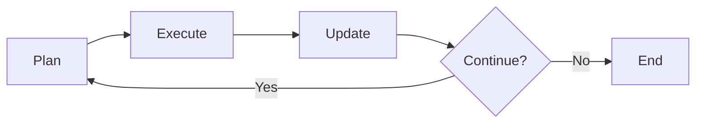

## Overview

LangGraph implements a stateful, cyclic computational graph based on Google's **Pregel** algorithm. Unlike traditional DAGs (Directed Acyclic Graphs), LangGraph graphs can contain cycles, making them ideal for agentic workflows that require iterative reasoning, tool usage, and human feedback loops.

## The Pregel Model

LangGraph's execution follows the **Bulk Synchronous Parallel (BSP)** model, organizing computation into discrete steps:



Each step consists of three phases:

1. **Plan**: Determine which nodes to execute based on channel updates
2. **Execute**: Run selected nodes in parallel until completion or timeout
3. **Update**: Apply node outputs to channels for the next step

<Note>
During execution, channel updates are invisible to nodes until the next step. This ensures consistency and prevents race conditions.
</Note>

## StateGraph: The Primary API

`StateGraph` is the main interface for building LangGraph applications. It manages shared state across nodes using a type-safe schema.

### Basic Structure

```python
from typing_extensions import TypedDict
from langgraph.graph import StateGraph, START, END

class State(TypedDict):
    messages: list[str]
    count: int

def my_node(state: State) -> dict:
    return {"count": state["count"] + 1}

builder = StateGraph(State)
builder.add_node("process", my_node)
builder.add_edge(START, "process")
builder.add_edge("process", END)

graph = builder.compile()
```

### Graph Components

<CardGroup cols={2}>
  <Card title="Nodes" icon="circle">
    Computational units that read state and return updates. Can be functions, Runnables, or callables.
  </Card>
  <Card title="Edges" icon="arrow-right">
    Define execution flow between nodes. Can be unconditional or conditional.
  </Card>
  <Card title="State" icon="database">
    Shared data structure accessible to all nodes. Supports reducers for merging updates.
  </Card>
  <Card title="Channels" icon="tower-broadcast">
    Internal communication layer that stores and propagates state changes.
  </Card>
</CardGroup>

## Graph Compilation

The `compile()` method transforms a `StateGraph` into an executable `CompiledStateGraph` (which extends `Pregel`):

```python
from langgraph.checkpoint.memory import InMemorySaver

compiled = builder.compile(
    checkpointer=InMemorySaver(),  # Enable persistence
    interrupt_before=["human_review"],  # Pause before node
    interrupt_after=["tool_call"],      # Pause after node
    debug=True                           # Enable debug logging
)
```

### Compilation Options

| Parameter | Type | Description |
|-----------|------|-------------|
| `checkpointer` | `BaseCheckpointSaver \| None \| bool` | Enables state persistence and time-travel |
| `interrupt_before` | `list[str] \| All` | Nodes to pause before executing |
| `interrupt_after` | `list[str] \| All` | Nodes to pause after executing |
| `cache` | `BaseCache \| None` | Cache for node results |
| `store` | `BaseStore \| None` | Persistent memory store |
| `debug` | `bool` | Enable debug mode |
| `name` | `str` | Graph name for identification |

## Execution Flow

When you invoke a compiled graph:

```python
result = compiled.invoke({"messages": [], "count": 0})
```

The graph:

1. Creates a checkpoint (if checkpointer enabled)
2. Maps input to channels
3. Determines which nodes to execute (starting from `START`)
4. Executes nodes in parallel
5. Applies updates to channels
6. Repeats until `END` is reached or max steps exceeded
7. Returns final state

## Advanced: Direct Pregel API

<Warning>
Most users should use `StateGraph`. The direct Pregel API is for advanced use cases requiring fine-grained control over channels and actors.
</Warning>

The `Pregel` class provides low-level access to the execution engine:

```python
from langgraph.pregel import Pregel, NodeBuilder
from langgraph.channels import LastValue, EphemeralValue

node = (
    NodeBuilder()
    .subscribe_only("input")
    .do(lambda x: x.upper())
    .write_to("output")
    .build()
)

app = Pregel(
    nodes={"transformer": node},
    channels={
        "input": EphemeralValue(str),
        "output": LastValue(str),
    },
    input_channels="input",
    output_channels="output",
)

result = app.invoke({"input": "hello"})
# {'output': 'HELLO'}
```

## Graph Visualization

Generate visual representations of your graph:

```python
# Get drawable graph
graph_diagram = compiled.get_graph()

# Export as PNG
graph_diagram.draw_mermaid_png(output_file_path="graph.png")

# Export as Mermaid markdown
print(graph_diagram.draw_mermaid())

# In Jupyter notebooks, graphs render automatically
compiled  # Displays graph inline
```

## Subgraphs

LangGraph supports nested graphs for modular design:

```python
# Create a subgraph
subgraph = StateGraph(SubState)
subgraph.add_node("sub_node", sub_logic)
subgraph.add_edge(START, "sub_node")
subgraph.add_edge("sub_node", END)
compiled_sub = subgraph.compile()

# Use it as a node in parent graph
parent = StateGraph(ParentState)
parent.add_node("subgraph", compiled_sub)
parent.add_edge(START, "subgraph")
parent.add_edge("subgraph", END)

final_graph = parent.compile()
```

Subgraphs:
- Maintain their own state
- Can have independent checkpointers
- Support recursive visualization with `get_graph(xray=True)`
- Enable code reuse and separation of concerns

## Best Practices

<AccordionGroup>
  <Accordion title="Design Principles">
    - Keep nodes focused on single responsibilities
    - Use state schemas to enforce type safety
    - Leverage reducers for complex state updates
    - Design for observability with meaningful node names
  </Accordion>
  
  <Accordion title="Performance">
    - Nodes in the same step execute in parallel by default
    - Use `defer=True` for nodes that can wait until graph completion
    - Enable caching for expensive operations
    - Consider `step_timeout` for long-running nodes
  </Accordion>
  
  <Accordion title="Error Handling">
    - Validate state schemas at graph construction time
    - Handle exceptions within nodes when possible
    - Use retry policies for transient failures
    - Enable checkpointing for crash recovery
  </Accordion>
</AccordionGroup>

## Next Steps

<CardGroup cols={2}>
  <Card title="State Management" icon="database" href="./state">
    Learn how to define and manage shared state with reducers
  </Card>
  <Card title="Nodes & Edges" icon="diagram-project" href="./nodes-edges">
    Explore node types, conditional routing, and control flow
  </Card>
  <Card title="Checkpointing" icon="floppy-disk" href="./checkpointing">
    Enable persistence, time-travel, and crash recovery
  </Card>
  <Card title="Streaming" icon="water" href="./streaming">
    Stream partial results and implement real-time UIs
  </Card>
</CardGroup>
