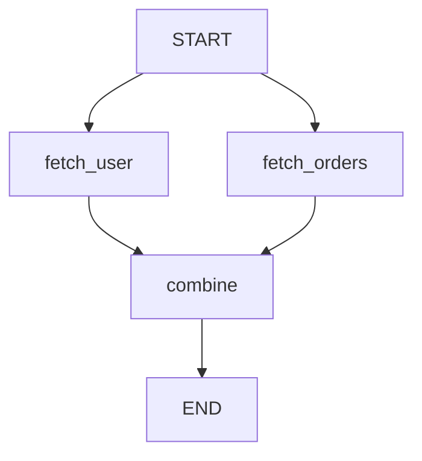

## Overview

Nodes are the computational units in LangGraph, while edges define the execution order. Together they form a directed graph that can contain cycles for iterative workflows.

## Nodes

A node is any callable that accepts state and returns a partial state update.

### Function Nodes

The simplest node is a Python function:

```python
from typing_extensions import TypedDict
from langgraph.graph import StateGraph, START, END

class State(TypedDict):
    count: int
    message: str

def increment(state: State) -> dict:
    """A basic node that increments count."""
    return {"count": state["count"] + 1}

def format_message(state: State) -> dict:
    """Format a message based on count."""
    return {"message": f"Count is {state['count']}"}

builder = StateGraph(State)
builder.add_node("increment", increment)
builder.add_node("format", format_message)
```

### Runnable Nodes

Any LangChain `Runnable` can be a node:

```python
from langchain_core.runnables import RunnableLambda
from langchain_core.prompts import ChatPromptTemplate
from langchain_openai import ChatOpenAI

# Runnable chain as a node
chain = (
    ChatPromptTemplate.from_messages([
        ("system", "You are a helpful assistant."),
        ("human", "{input}"),
    ])
    | ChatOpenAI()
)

builder.add_node("llm", chain)
```

### Class-Based Nodes

Callable classes work as nodes:

```python
class ProcessorNode:
    def __init__(self, config: dict):
        self.config = config
    
    def __call__(self, state: State) -> dict:
        # Use self.config in processing
        return {"count": state["count"] * 2}

processor = ProcessorNode(config={"multiplier": 2})
builder.add_node("processor", processor)
```

### Node Signatures

Nodes can access runtime context:

```python
from langchain_core.runnables import RunnableConfig
from langgraph.runtime import Runtime

class Context(TypedDict):
    user_id: str

# With RunnableConfig
def node_with_config(state: State, config: RunnableConfig) -> dict:
    thread_id = config["configurable"]["thread_id"]
    return {"message": f"Thread: {thread_id}"}

# With Runtime context
def node_with_context(state: State, runtime: Runtime[Context]) -> dict:
    user_id = runtime.context["user_id"]
    return {"message": f"User: {user_id}"}

builder.add_node("node1", node_with_config)
builder.add_node("node2", node_with_context)
```

### Async Nodes

Nodes can be async for concurrent I/O:

```python
import asyncio

async def fetch_data(state: State) -> dict:
    # Simulate API call
    await asyncio.sleep(1)
    data = await fetch_from_api()
    return {"data": data}

builder.add_node("fetch", fetch_data)

# Use ainvoke or astream
result = await graph.ainvoke({"count": 0})
```

### Node Metadata

Attach metadata for observability:

```python
builder.add_node(
    "expensive_operation",
    my_node,
    metadata={
        "cost": "high",
        "timeout": 30,
        "version": "2.0"
    }
)
```

## Edges

Edges define the execution order between nodes.

### Unconditional Edges

Fixed transitions from one node to another:

```python
builder = StateGraph(State)
builder.add_node("step1", node1)
builder.add_node("step2", node2)
builder.add_node("step3", node3)

# Linear flow
builder.add_edge(START, "step1")
builder.add_edge("step1", "step2")
builder.add_edge("step2", "step3")
builder.add_edge("step3", END)

# Or use helper methods
builder.set_entry_point("step1")  # START -> step1
builder.set_finish_point("step3")  # step3 -> END
```

### Parallel Edges

Multiple nodes execute in parallel:

```python
builder.add_node("fetch_user", fetch_user)
builder.add_node("fetch_orders", fetch_orders)
builder.add_node("combine", combine_results)

# Both fetch nodes run in parallel
builder.add_edge(START, "fetch_user")
builder.add_edge(START, "fetch_orders")

# Wait for both before combining
builder.add_edge(["fetch_user", "fetch_orders"], "combine")
builder.add_edge("combine", END)
```



### Conditional Edges

Dynamic routing based on state:

```python
def route_after_llm(state: State) -> str:
    """Route based on LLM response."""
    if "tool_call" in state["last_message"]:
        return "tools"
    return "end"

builder.add_node("llm", llm_node)
builder.add_node("tools", tool_node)

builder.add_conditional_edges(
    "llm",
    route_after_llm,
    {
        "tools": "tools",
        "end": END
    }
)

# Tool output goes back to LLM (creating a loop)
builder.add_edge("tools", "llm")
```

### Multi-Destination Routing

Return multiple destinations to run in parallel:

```python
from typing import Sequence

def fan_out(state: State) -> Sequence[str]:
    """Route to multiple nodes based on conditions."""
    destinations = []
    if state["needs_validation"]:
        destinations.append("validate")
    if state["needs_logging"]:
        destinations.append("log")
    return destinations

builder.add_conditional_edges(
    "prepare",
    fan_out,
    # No path_map needed - function returns node names directly
)
```

### Type-Safe Routing with Literals

```python
from typing import Literal

def strict_router(state: State) -> Literal["success", "failure"]:
    """Type-checked routing."""
    if state["count"] > 0:
        return "success"
    return "failure"

builder.add_conditional_edges(
    "process",
    strict_router,
    {
        "success": "handle_success",
        "failure": "handle_failure"
    }
)
```

## The Send API

Dynamically invoke nodes with custom input (map-reduce pattern):

```python
from langgraph.types import Send
from typing import Annotated
import operator

class OverallState(TypedDict):
    subjects: list[str]
    results: Annotated[list[str], operator.add]

class SubjectState(TypedDict):
    subject: str

def continue_to_process(state: OverallState) -> list[Send]:
    """Fan out to process each subject independently."""
    return [
        Send("process_subject", {"subject": s})
        for s in state["subjects"]
    ]

def process_subject(state: SubjectState) -> dict:
    """Process a single subject."""
    result = f"Processed {state['subject']}"
    return {"results": [result]}

builder = StateGraph(OverallState)
builder.add_node("process_subject", process_subject)
builder.add_conditional_edges(START, continue_to_process)
builder.add_edge("process_subject", END)

graph = builder.compile()

result = graph.invoke({"subjects": ["math", "science", "history"]})
# {'subjects': [...], 'results': ['Processed math', 'Processed science', 'Processed history']}
```

<Note>
`Send` allows nodes to execute with different input than the main graph state, perfect for map-reduce workflows.
</Note>

## Command API

Return `Command` objects from nodes for advanced control flow:

```python
from langgraph.types import Command

def smart_node(state: State) -> Command:
    """Node that controls its own routing."""
    # Update state and navigate
    return Command(
        update={"count": state["count"] + 1},
        goto="next_step" if state["count"] < 5 else END
    )

def multi_send_node(state: State) -> Command:
    """Send to multiple nodes with custom input."""
    return Command(
        update={"status": "processing"},
        goto=[
            Send("worker", {"task_id": 1}),
            Send("worker", {"task_id": 2}),
        ]
    )

builder.add_node("smart", smart_node)
builder.add_edge(START, "smart")
# No need to define edges from 'smart' - Command handles routing
```

### Command Fields

| Field | Type | Description |
|-------|------|-------------|
| `update` | `dict \| Any` | State updates to apply |
| `goto` | `str \| list[str] \| Send \| list[Send]` | Next node(s) to execute |
| `graph` | `None \| "__parent__"` | Target graph for command |
| `resume` | `dict \| Any` | Resume value for interrupts |

## Sequences

Quickly add a chain of nodes:

```python
def step1(state: State) -> dict:
    return {"count": 1}

def step2(state: State) -> dict:
    return {"count": state["count"] + 1}

def step3(state: State) -> dict:
    return {"count": state["count"] * 2}

builder = StateGraph(State)

# Automatically creates edges: START -> step1 -> step2 -> step3 -> END
builder.add_sequence([step1, step2, step3])
builder.set_entry_point(step1.__name__)
builder.set_finish_point(step3.__name__)
```

## Cycles and Loops

LangGraph supports cycles for iterative workflows:

```python
def check_completion(state: State) -> str:
    if state["count"] >= 10:
        return "done"
    return "continue"

builder = StateGraph(State)
builder.add_node("work", do_work)
builder.add_edge(START, "work")

# Create a cycle
builder.add_conditional_edges(
    "work",
    check_completion,
    {
        "continue": "work",  # Loop back
        "done": END
    }
)
```

<Warning>
Cycles can run indefinitely. Set a `recursion_limit` to prevent infinite loops:

```python
graph = builder.compile()
result = graph.invoke(
    {"count": 0},
    config={"recursion_limit": 25}
)
```
</Warning>

## Retry Policies

Automatically retry failed nodes:

```python
from langgraph.types import RetryPolicy

retry_policy = RetryPolicy(
    initial_interval=0.5,    # Start with 0.5s
    backoff_factor=2.0,      # Double each retry
    max_interval=10.0,       # Cap at 10s
    max_attempts=3,          # Try 3 times
    jitter=True,             # Add randomness
    retry_on=Exception       # Retry on any exception
)

builder.add_node(
    "api_call",
    make_api_request,
    retry_policy=retry_policy
)
```

### Multiple Retry Policies

```python
from langgraph.types import RetryPolicy

# Different policies for different errors
retry_policies = [
    RetryPolicy(
        max_attempts=5,
        retry_on=RateLimitError,
        initial_interval=1.0
    ),
    RetryPolicy(
        max_attempts=2,
        retry_on=TimeoutError,
        initial_interval=0.1
    ),
]

builder.add_node(
    "flaky_node",
    my_node,
    retry_policy=retry_policies  # First matching policy applies
)
```

## Caching

Cache expensive node results:

```python
from langgraph.types import CachePolicy

cache_policy = CachePolicy(
    ttl=3600,  # 1 hour
)

builder.add_node(
    "expensive_llm_call",
    llm_node,
    cache_policy=cache_policy
)

# Must provide cache at compile time
from langgraph.cache.memory import InMemoryCache

graph = builder.compile(cache=InMemoryCache())
```

Cached nodes:
- Skip execution on cache hit
- Use input state as cache key (customizable)
- Respect TTL for expiration
- Store results across invocations

## Deferred Nodes

Delay node execution until graph end:

```python
builder.add_node(
    "cleanup",
    cleanup_resources,
    defer=True  # Runs after all other nodes complete
)
```

Use cases:
- Cleanup operations
- Final logging/metrics
- Post-processing steps

## Best Practices

<AccordionGroup>
  <Accordion title="Node Design">
    - Keep nodes pure and focused on single tasks
    - Use type hints for state and return values
    - Handle errors gracefully within nodes
    - Return partial state updates, not full state
    - Make nodes testable in isolation
  </Accordion>
  
  <Accordion title="Control Flow">
    - Prefer explicit edges for simple flows
    - Use conditional edges for dynamic routing
    - Use `Command` for complex multi-step routing
    - Document routing logic clearly
    - Test all routing paths
  </Accordion>
  
  <Accordion title="Performance">
    - Parallelize independent nodes
    - Use async nodes for I/O operations
    - Cache expensive operations
    - Set reasonable retry limits
    - Monitor node execution times
  </Accordion>
</AccordionGroup>

## Next Steps

<CardGroup cols={2}>
  <Card title="Checkpointing" icon="floppy-disk" href="./checkpointing">
    Persist state between node executions
  </Card>
  <Card title="Streaming" icon="water" href="./streaming">
    Stream node outputs in real-time
  </Card>
  <Card title="Human-in-the-Loop" icon="user" href="./human-in-the-loop">
    Add human review points with interrupts
  </Card>
</CardGroup>
